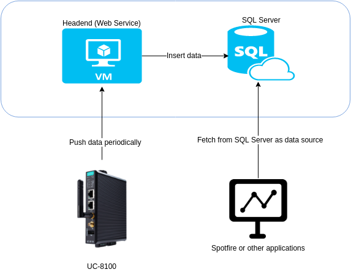
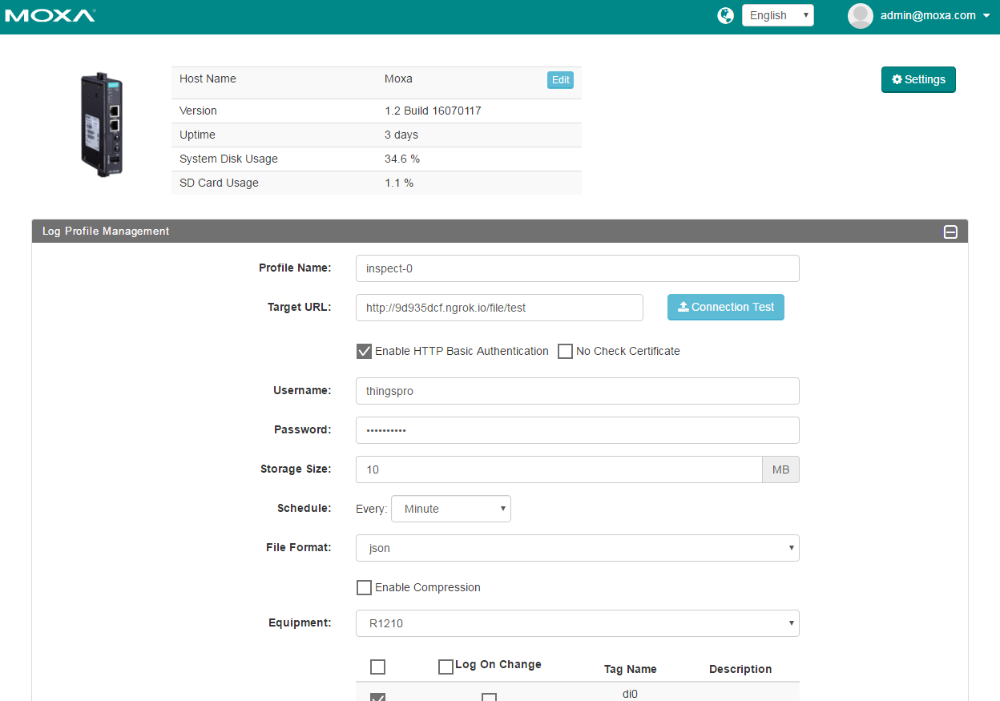
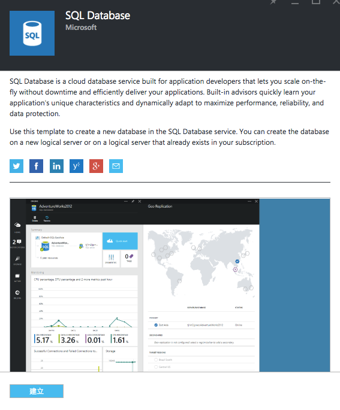
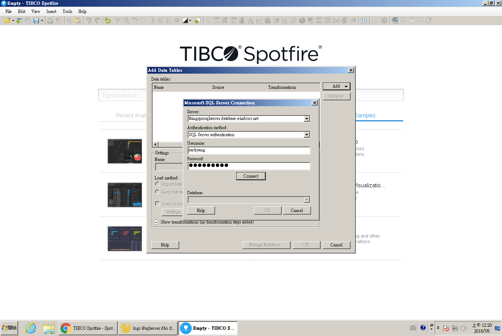
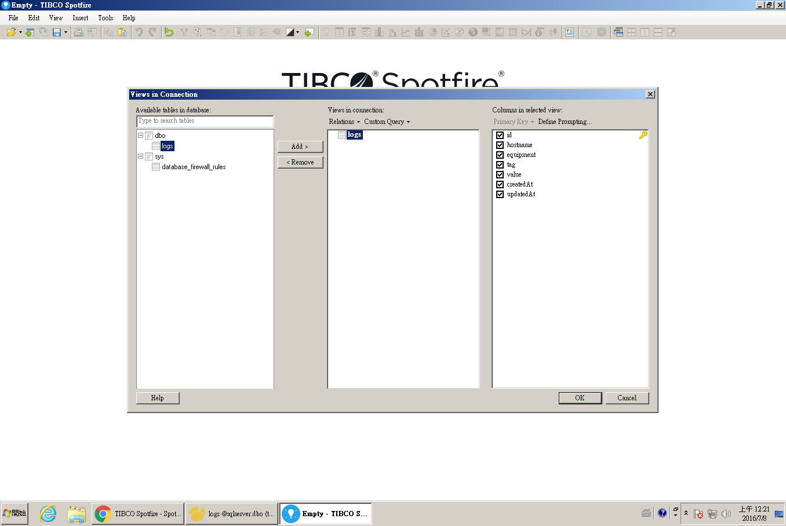
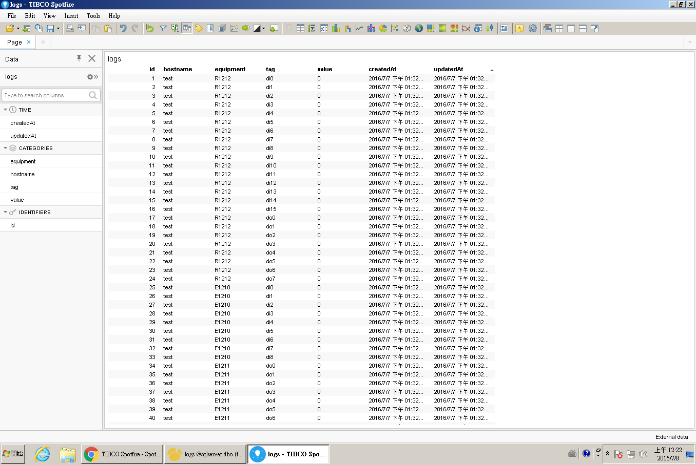

# awc-iiot-demo-web-server
This is a demo project for AWC. The demo server receives ThingsPro upload json data and insert data to SQL Server.

## Architecture

### Componments
- IoT gateway UC-8100 (collect edge devices/sensors data)
- Headend server (web service for retrieving files and insert to Azure SQL)
- Azure SQL instance (data warehouse)
- Spotfire or other applications (data analytics/data mining)

## Setup Instructions
### UC-8100
Setup equipments/tags and target url (headend server)

### Azure SQL Server
1. Create a SQL Server
2. Set proper username/password and firewall settings

### Azure VM (Ubuntu)
Install node.js on Azure Ubuntu VM. Source code is avaliable at: [https://github.com/Sanji-IO/awc-iiot-demo-web-server](https://github.com/Sanji-IO/awc-iiot-demo-web-server)

1. Create Ubuntu VM and launch
2. ssh login
3. `wget -qO- https://raw.githubusercontent.com/creationix/nvm/v0.31.2/install.sh | bash`
4. `nvm install 4`
5. `npm update -g npm`
6. `git clone https://github.com/Sanji-IO/awc-iiot-demo-web-server.git`
7. change folder to `awc-iiot-demo-web-server` and execute `npm install --production`
8. `NODE_ENV=production DB_SERVER=your_db_server_name DB_USER=your_db_username DB_PWD=your_db_password DB_HOST=your_db_hostname npm start`

### Spotfire
1. Add data tables
2. Add select Microsoft SQL Server
3. Enter username / password, press connect and OK
4. Select table “logs”
5. Now you could arrange Tables/Line Charts/Pie Charts as you want

